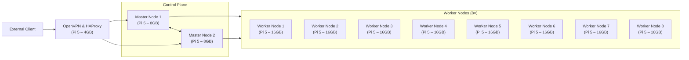

# Architecture Document

## Table of contents

1. [Components Table](#components-table)
2. [Architecture Flowchart](#architecture-flowchart)
3. [Installation](#installation)
4. [Project Pricing](#project-pricing)


## Components Table

| Role           | Hardware                     | Connected with                                               | Market link                                               | Price      |
|----------------|------------------------------|--------------------------------------------------------------|-----------------------------------------------------------|------------|
| Load Balancer  | Raspberry Pi 5 (4GB RAM)     | Master nodes (control plane)                                 | [Raspberry Pi 5 4GB](https://minicomp.com.ua/ru/raspberry-pi/raspberry-pi-5/raspberry-pi-5-4gb)   | 3 699 грн |
| VPN Gateway    | Raspberry Pi 5 (4GB RAM)     | External clients, LAN network, Load Balancer                 | [Raspberry Pi 5 4GB](https://minicomp.com.ua/ru/raspberry-pi/raspberry-pi-5/raspberry-pi-5-4gb)   | 3 699 грн |
| Master Node    | Raspberry Pi 5 (8GB RAM)     | Load Balancer (API traffic), etcd peer (other master)        | [Raspberry Pi 5 8GB](https://minicomp.com.ua/ru/raspberry-pi/raspberry-pi-5/raspberry-pi-5-8gb)   | 4 769 грн |
| Worker Node    | Raspberry Pi 5 (16GB RAM)    | Master nodes (via HAProxy), other workers for services mesh  | [Raspberry Pi 5 16GB](https://minicomp.com.ua/ru/raspberry-pi/raspberry-pi-5/raspberry-pi-5-16gb) | 6 999 грн |

## Architecture Flowchart


## Installation

### HAProxy Configuration

On the Load Balancer (Pi 5 – 4GB):

```bash
sudo apt update && sudo apt install -y haproxy
```

```haproxy
defaults
  log global
  mode tcp
  timeout connect 10s
  timeout client 1m
  timeout server 1m

frontend k8s_api
  bind *:6443
  default_backend k8s_masters

backend k8s_masters
  balance roundrobin
  option tcp-check
  server master1 192.168.1.101:6443 check
  server master2 192.168.1.102:6443 check
```

Restart HAProxy:

```bash
sudo systemctl restart haproxy
```

### K3s Installation Guide

#### Master Node 1 (Cluster Init)

```bash
curl -sfL https://get.k3s.io |   INSTALL_K3S_EXEC="server --cluster-init --node-taint CriticalAddonsOnly=true:NoExecute --tls-san 192.168.1.100"   sh -
```

- TLS SAN should match your Load Balancer IP (`192.168.1.100`).
- Retrieve the cluster token:

```bash
sudo cat /var/lib/rancher/k3s/server/node-token
```

#### Master Node 2

```bash
export TOKEN="<node-token-from-master1>"
curl -sfL https://get.k3s.io |   INSTALL_K3S_EXEC="server --server https://192.168.1.100:6443 --token $TOKEN --node-taint CriticalAddonsOnly=true:NoExecute --tls-san 192.168.1.100"   sh -
```

#### Worker Nodes (Repeat for each worker)

```bash
export TOKEN="<node-token-from-master1>"
curl -sfL https://get.k3s.io |   K3S_URL=https://192.168.1.100:6443 K3S_TOKEN=$TOKEN   sh -
```

### OpenVPN Configuration

On the VPN & HAProxy Pi (Pi 5 – 4GB):

1. Install OpenVPN:

    ```bash
    sudo apt update && sudo apt install -y openvpn
    ```

2. Generate server certificates (e.g., using **easy-rsa**).

3. Example `/etc/openvpn/server.conf`:

    ```ini
    port 1194
    proto udp
    dev tun0
    server 10.8.0.0 255.255.255.0
    push "route 192.168.1.0 255.255.255.0"
    keepalive 10 120
    persist-key
    persist-tun
    user nobody
    group nogroup
    ```

4. Enable and start the service:

    ```bash
    sudo systemctl enable openvpn@server
    sudo systemctl start openvpn@server
    ```

5. Forward UDP 1194 on your router to this Pi. Import the `.ovpn` client profile to connect.

## Project Pricing

| Device                 | Quantity | Unit Price (грн) | Total (грн) |
|------------------------|----------|------------------|-------------|
| Raspberry Pi 5 (4GB)   | 1        | 3 699            | 3 699       |
| Raspberry Pi 5 (8GB)   | 2        | 4 769            | 9 538       |
| Raspberry Pi 5 (16GB)  | 8        | 6 999            | 55 992      |
| **Grand Total**        |          |                  | **69 229**  |